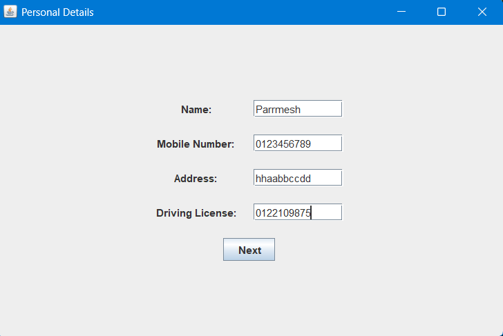
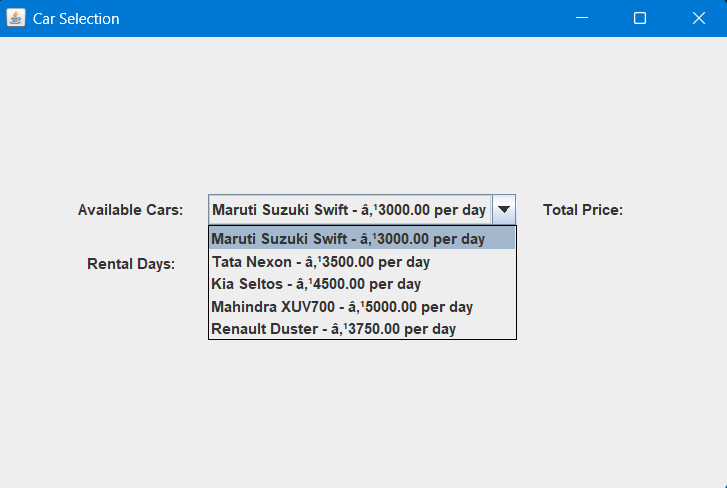
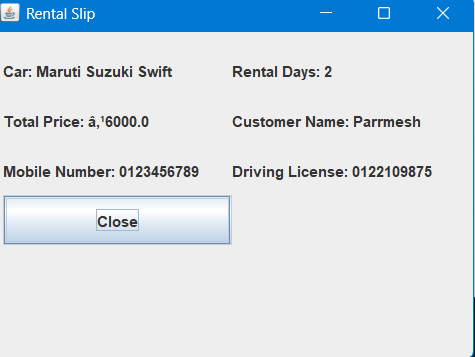

# 🚗 Car Rental System

A Java desktop application simulating a car rental service, built as an academic project using **Java Swing** for the GUI and a **terminal-based** CLI version.

---

## ✨ Features

- 📝 Multi-step form — collect customer details before car selection
- 🚘 Dropdown of available cars with live ₹ price calculation
- 🧾 Rental Slip popup after successful booking
- ✅ Input validation with user-friendly error messages
- 🔄 Car list updates dynamically after each rental

---

## 🛠️ Tech Stack

| Technology | Purpose |
|---|---|
| Java SE | Core language |
| Java Swing / AWT | GUI framework |
| Apache Ant | Build automation (`build.xml`) |

---

## ▶️ How to Run

> **Requires:** JDK 8 or higher — [Download here](https://adoptium.net)

**GUI Version (Recommended)**
```bash
javac "car rental final code.java"
java CarRentalGUI
```

**Terminal Version**
```bash
javac Main.java
java Main
```

---

## 📸 Screenshots

### Step 1 — Personal Details


### Step 2 — Car Selection


### Step 3 — Rental Slip


---

## 🚙 Pre-loaded Cars (GUI Version)

| Brand | Model | Rate/Day |
|---|---|---|
| Maruti Suzuki | Swift | ₹3,000 |
| Hyundai | Creta | ₹4,000 |
| Tata | Nexon | ₹3,500 |
| Kia | Seltos | ₹4,500 |
| Mahindra | XUV700 | ₹5,000 |
| Renault | Duster | ₹3,750 |

---

## 👤 Author

**Parmesh Goyal** · [GitHub](https://github.com/parmeshgoyal)

> *Developed as part of a Java programming course to demonstrate OOP concepts — encapsulation, class design, collections, event-driven programming, and Swing GUI development.*
